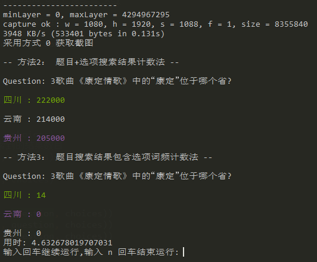
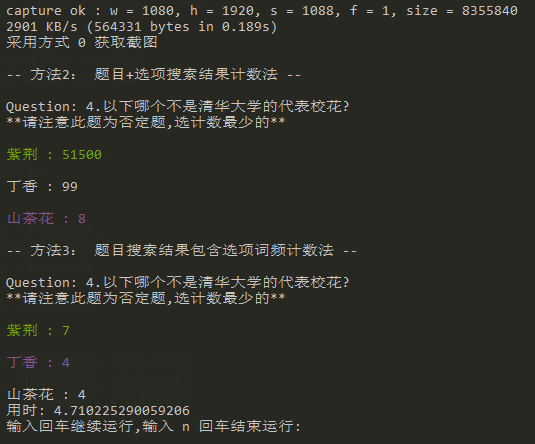

# 答题辅助
这两天冲顶大会之类的直播答题 APP 突然火了起来，萌生了使用截图，文字识别，搜索来玩答题的想法。

因为时间、搜索结果等限制，使用文字识别搜索，能提供的辅助作用有限。


**非常感谢关注，欢迎大家 PR 更多有趣的想法和优化。**


**目录**

- [答题辅助](#答题辅助)
  - [更新日志](#更新日志)
  - [具体做法](#具体做法)
  - [结果判断方式](#结果判断方式)
  - [使用步骤 (谷歌 Tesseract)](#使用步骤-谷歌-tesseract)
  - [使用步骤 (百度 OCR)](#使用步骤-百度-ocr)
- [其它](#其它)
- [总结](#总结)
- [Next](#next)


## 更新日志

- 2018.01.14
  - 文字识别方法集成 baidu ocr ，相对来说识别快 ，可在运行代码中选择想要用的 ocr 方式
  - 题目和选项一次截取识别
  - 将需要配置的参数统一调整到 `config/configure.conf`中
- 2018.01.12
  - 修复 windows 命令行颜色乱码，处理一些识别错误
- 2018.01.11
  - 修复搜索可能的乱码等一些问题，多线程加快执行
- 2018.01.10
  - 增加循环，无需重复加载，优化逻辑和显示 来自 [issue #7](https://github.com/Skyexu/TopSup/issues/7)。增加部分手机截图设置
  - 增加了截图传输效率，修改了识别参数，对图像进行灰度转化，去干扰，增加了识别准确率。结果判断使用了三种方式，对不同问题可以参考不同结果。


## 具体做法

1. ADB 获取手机截屏
```
adb shell screencap -p /sdcard/screenshot.png
adb pull /sdcard/screenshot.png .
```
2. OCR 识别题目与选项文字   

  

  ​
  两个方法：

  - 谷歌 [Tesseract](https://github.com/madmaze/pytesseract) ，安装软件即可，不同电脑配置运行效率不同
  - [百度 OCR](https://cloud.baidu.com/product/ocr) ，需要注册百度 API，每天调用次数有限

3. 搜索判断

## 结果判断方式

1. 直接打开浏览器搜索问题
  
2. 题目+每个选项都通过搜索引擎搜索，从网页代码中提取搜索结果计数
3. 只用题目进行搜索，统计结果页面代码中包含选项的词频

以下为两个示例结果





参考了 [I Hacked HQ Trivia But Here’s How They Can Stop Me](https://hackernoon.com/i-hacked-hq-trivia-but-heres-how-they-can-stop-me-68750ed16365)

## 使用步骤 (谷歌 Tesseract)
### Android

#### 1. 安装 ADB

**windows**

下载地址：https://adb.clockworkmod.com/ ，并配置环境变量

**Mac**

使用 brew 进行安装 `brew cask install android-platform-tools`


安装完后插入安卓设备且安卓已打开 USB 调试模式，终端输入 `adb devices` ，显示设备号则表示成功。我手上的机子是坚果 pro1，第一次不成功,查看设备管理器有叹号，使用 [handshaker](https://www.smartisan.com/apps/handshaker) 加载驱动后成功，也可以使用豌豆荚之类的试试。

```
List of devices attached
6934dc33    device
```

若不成功，可以参考[Android 和 iOS 操作步骤](https://github.com/wangshub/wechat_jump_game/wiki/Android-%E5%92%8C-iOS-%E6%93%8D%E4%BD%9C%E6%AD%A5%E9%AA%A4)进行修改

#### 2. 安装 python 3
#### 3. 安装所需 python 包

命令行：
`pip install -r requirements.txt`

或者
```
pip install pytesseract
pip install pillow  
pip install requests
pip install colorama
pip install baidu-aip
```
#### 4. 安装 谷歌 Tesseract

Windows下链接：
*推荐使用安装版，在安装时选择增加中文简体语言包*
- 安装版：
  https://digi.bib.uni-mannheim.de/tesseract/tesseract-ocr-setup-3.05.01.exe
- 免安装版：
  https://github.com/parrot-office/tesseract/releases/download/3.5.1/tesseract-Win64.zip
  *免安装版需要下载[中文语言包](https://github.com/tesseract-ocr/tesseract/wiki/Data-Files)，放置到Tesseract的`tessdata`目录下*

其他系统：
https://github.com/tesseract-ocr/tesseract/wiki

#### 5. 修改  `config/configure.conf` 中相应参数信息
```
[region]
# 题目与选项区域
question_region = 50, 350, 1000, 560
choices_region = 75, 535, 1000, 1200

# 题目和选项一起的区域
combine_region = 50, 350, 1000, 1200

[tesseract]
# windows
# tesseract 安装路径
tesseract_cmd = C:\\Program Files (x86)\\Tesseract-OCR\\tesseract

# 语言包目录和参数
tessdata_dir_config = --tessdata-dir "C:\\Program Files (x86)\\Tesseract-OCR\\tessdata" --psm 6

# mac 环境, 文件夹分割请使用 / 代替 \\ 如 '/usr/local/Cellar/tesseract/3.05.01/bin/tesseract'
```

**注： 可以用 `GetImgTool.py` 调整题目截取位置**
可以到[这里](/config/devicesCutConfig.txt)查看部分手机截图设置

#### 6. 运行脚本

`python GetQuestionAndroid.py`
会自动识别文字并打开浏览器

### IOS

**部分朋友成功**

- 需要安装 WDA 进行截图，参考
  -  [iOS 真机如何安装 WebDriverAgent](https://testerhome.com/topics/7220) 
  -  [Android 和 iOS 操作步骤](https://github.com/wangshub/wechat_jump_game/wiki/Android-%E5%92%8C-iOS-%E6%93%8D%E4%BD%9C%E6%AD%A5%E9%AA%A4)
- 安装 [python-wda](https://github.com/openatx/facebook-wda)
- 其他步骤相同。
- `python GetQuestionIos.py`

## 使用步骤 (百度 OCR)

1. 在[百度平台](https://cloud.baidu.com/product/ocr)上创建应用申请 API Key 和 Secret Key

2. 安装所需 python 包

   命令行：

   `pip install -r requirements.txt`

   或者

       pip install pytesseract
       pip install pillow  
       pip install requests
       pip install colorama
       pip install baidu-aip

   ​

3. 在 `config/configure.conf` 中加入相应 key, 并设置截取区域

      ```
      [region]
      # 题目和选项一起的区域
      combine_region = 50, 350, 1000, 1200
      [baidu_api]
      APP_ID = 
      API_KEY = 
      SECRET_KEY = 
      ```

4. 在`GetQuestionAndroid.py`中切换识别方法

  ```
  #ocr_img: 需要分别截取题目和选项区域，使用 Tesseract
  #ocr_img_tess： 题目和选项一起截，使用 Tesseract
  #ocr_img_baidu： 题目和选项一起截，使用 baidu ocr，需配置 key
      
  # question, choices = ocr.ocr_img(img, config)
  # question, choices = ocr.ocr_img_tess(img, config)
  question, choices = ocr.ocr_img_baidu(img, config)
  ```

5. 其它环境配置与 Tesseract 步骤相同

6. 运行脚本 

   安卓： `python GetQuestionAndroid.py`


## 其它
- Tesseract 参数，若识别有问题可以更改参数解决
  https://github.com/tesseract-ocr/tesseract/blob/master/doc/tesseract.1.asc

- 结果分析三种方法可以选择，可以加`#`注释掉只保留一个方法

- windows 命令行有很多乱码问题，建议使用 [cmder](http://cmder.net/) 作为命令工具，可以支持 linux 命令

- 版本说明

  - [简单验证思路访问浏览器版本](/simpleVersion)

  - 最新版本：本目录

    ​


## 总结

有了 ADB 截图，能玩出更多花样。python 写小脚本真的很方便。

## Next

- 文字识别后 nlp 处理一下关系，然后搜索不同选择结果


